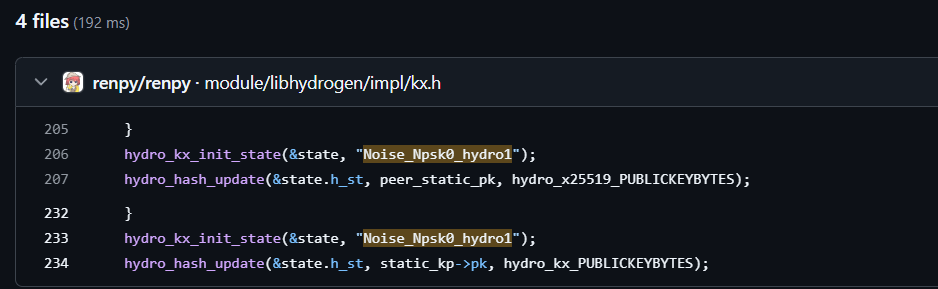
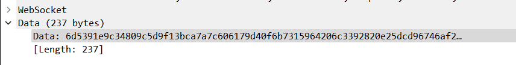
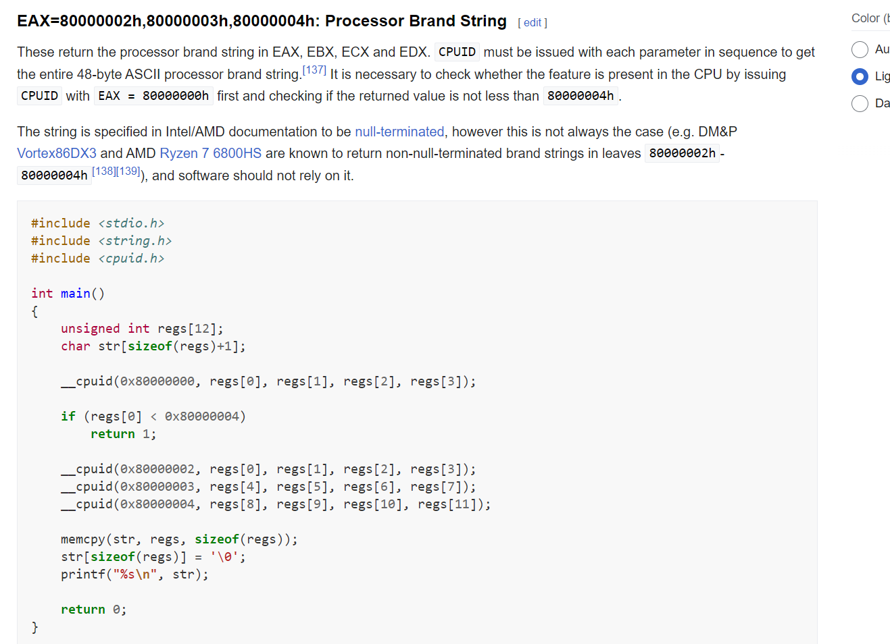
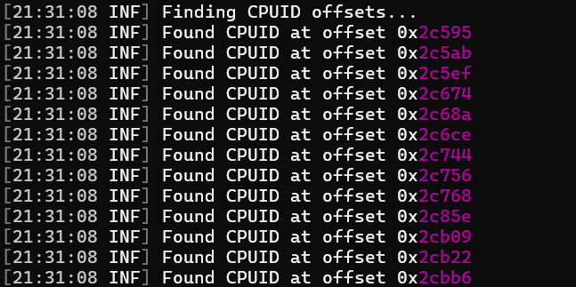
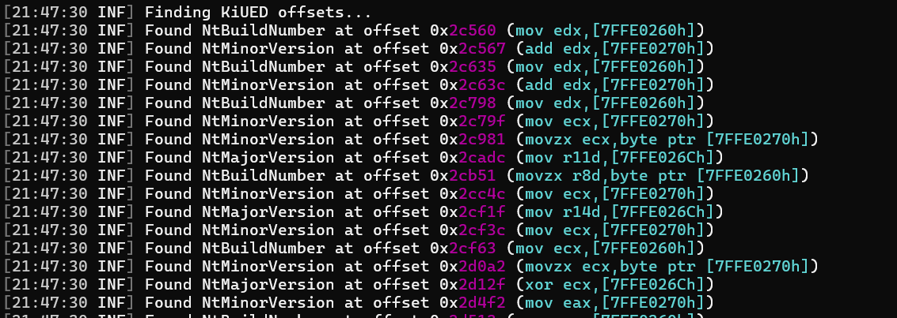
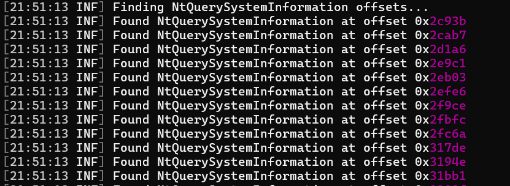

# Sekai Licensing

### Overview

Sekai Licensing is a challenge inspired by hardware-based licensing techniques used by modern DRM schemes. Particular inspiration was taken from the [leaked unprotected crack for Need for Speed: Heat](https://www.reddit.com/r/Piracy/comments/egt1zg/unfinished_codex_denuvo_crack_leaked_potentially/) by scene group CODEX. They were able to crack the DRM implementation on this game by replacing its accesses to hardware information with traps and emulating each access within VEH handlers.

This challenge is designed to encourage a similar solution. Sekai Licensing requires you to extract the correct hardware information (and license key) from a packet capture, then patch each hardware access in order to get the flag.

### Breaking the Key Exchange

The first hurtle in cracking Sekai Licensing is breaking its key exchange mechanism. When you open the packet capture included, we can clearly see the WebSocket communications are encrypted. We must figure out the algorithm and key exchange mechanism used.

Using strings in the binary, we know Sekai Licensing uses [IXWebSocket](https://github.com/machinezone/IXWebSocket).  IXWebSocket uses a single callback for WebSocket messages, so we must first find that. In the main function, we can see a reference to RVA `29870`. 

```cpp
  // 1400283E1
  Mtx_unlock((_Mtx_t)&dword_1400969B8);
  if ( v111 >= 0x10 )
  {
    v113 = *(void **)&WSAData.wVersion;
    if ( v111 + 1 >= 0x1000 )
    {
      if ( (unsigned __int64)(*(_QWORD *)&WSAData.wVersion - 8LL - *(_QWORD *)(*(_QWORD *)&WSAData.wVersion - 8LL)) >= 0x20 )
        invalid_parameter_noinfo_noreturn();
      v113 = *(void **)(*(_QWORD *)&WSAData.wVersion - 8LL);
    }
    j_j_j__free_base(v113);
  }
  v118[0] = (__int64)off_140082110; 
  v118[1] = (__int64)sub_140029870; // <-- Message callback
  v119 = v118;
  p_Src = 0LL;
  sub_14004DD90(v118, &Src);
```

This also happens to be the largest function in the binary, so we can be confident that this is the callback for WebSocket communications.

The function signature for IXWebSocket's callback is `void callback(const ix::WebSocketMessagePtr&)`. Looking at the members in this structure, we should take note of the most important member: the type of the message.

```cpp
struct WebSocketMessage
{
	WebSocketMessageType type;
	const std::string& str;
	size_t wireSize;
	WebSocketErrorInfo errorInfo;
	WebSocketOpenInfo openInfo;
	WebSocketCloseInfo closeInfo;
	bool binary;
	
	// ...
};

enum class WebSocketMessageType
{
	Message = 0,
	Open = 1,
	Close = 2,
	Error = 3,
	Ping = 4,
	Pong = 5,
	Fragment = 6
};
```

We need to find the key exchange sequence first, so we must look for the `Open` case.

Finding the switch case within the function, we can see our first annoyance: encrypted strings.

```cpp
    // 14002A721
    case 1:
      v4676.m128_u64[0] = 0x62DE4099FCD5F393LL;
      v4676.m128_u64[1] = 0x3568E3970E876337LL;
      v4677.m128_u64[0] = 0x5C4BC810A6B563BELL;
      v4677.m128_u64[1] = 0xAD6CA38C4705F0A9uLL;
      v4678[0].m128i_i64[0] = 0xD9180D10D0C3E7BFuLL;
      v4678[0].m128i_i64[1] = 0xCBA6780D3959B688uLL;
      v4678[1].m128i_i64[0] = 0x88FE1E6A052A8151uLL;
      v4678[1].m128i_i64[1] = 0xAE585AA7D5B1190AuLL;
      v4676 = _mm_xor_ps(v4676, (__m128)v4678[0]);
      v4677 = _mm_xor_ps(v4677, (__m128)v4678[1]);
      v4687[0].m128i_i64[0] = 0x7A3DF7D8F530419BLL;
      v4687[0].m128i_i64[1] = 0x7843B8188CC84E65LL;
      v4687[1].m128i_i64[0] = 0xD6BC13CB746189F8uLL;
      v4687[1].m128i_i64[1] = 0x2F99A8E17FFBCB8LL;
      v4662[0].m128i_i64[0] = 0xA73A8BD86592ED5LL;
      v4662[0].m128i_i64[1] = 0xA27C170D3F82516LL;
      v4662[1].m128i_i64[0] = 0xD6BC13CB7461B897uLL;
      v4662[1].m128i_i64[1] = 0x2F99A8E17FFBCB8LL;
      v140 = v4662;
      v4687[0] = (__m128i)_mm_xor_ps((__m128)v4687[0], (__m128)v4662[0]);
      v4687[1] = _mm_xor_si128(_mm_load_si128(&v4687[1]), v4662[1]);
      memset(v4678, 0, 116);
      v4662[0].m128i_i32[0] = 1634560772;
      v4662[0].m128i_i16[2] = 2147;
      *(__m128i *)((char *)v4662 + 14) = 0LL;
      *(__m128i *)((char *)&v4662[1] + 14) = 0LL;
      *(__m128i *)((char *)&v4662[2] + 14) = 0LL;
      v4662[3].m128i_i16[7] = 0;
      *(__int64 *)((char *)v4662[0].m128i_i64 + 6) = 0x786B5F6F72647968LL;
      v141 = 32LL;
      v142 = 0;
```

Luckily, using X86 emulation plugins like [EmuIt](https://github.com/AzzOnFire/emuit), we can easily decrypt these strings. 

Once we decrypt these strings, we notice one that pops up in particular:
```
0x2fca90 b'Noise_Npsk0_hydro1\x00\x00\x00\x00\x00\x00\x00\x00\x00\x00\x00\x00\x00\x00'
```

GitHub code search can find where this string originates from:



Its the [libhydrogen](Ihttps://github.com/jedisct1/libhydrogen) library! Specifically, its the [Noise Protocol's N variant](https://github.com/jedisct1/libhydrogen/wiki/N-variant). We now know the library used to perform the key exchange. Another one of the strings we decrypted also reveals the public key for the server. One problem though: isn't Libhydrogen secure? How are we supposed to break proven cryptographic primitives?

As it turns out, the solution to this problem is hiding in plain sight within the main function itself. We can see a reference to TLS initializers, which is usually a good hint on Windows binaries that this is a thread-local variable being accessed.

```cpp
  // 1400277BC
  if ( !*(_BYTE *)(*((_QWORD *)NtCurrentTeb()->ThreadLocalStoragePointer + (unsigned int)TlsIndex) + 72LL) )
  {
    seed = __rdtsc();
    LOBYTE(seed) = seed ^ 'u';  // <-- RNG seed
    v21 = *(_BYTE *)(*((_QWORD *)NtCurrentTeb()->ThreadLocalStoragePointer + (unsigned int)TlsIndex) + 8LL);
    LOBYTE(v4) = 'i';
    LOBYTE(v17) = 'k';
    LOBYTE(v3) = 'm';
    for ( j = 0LL; j != 48; ++j )
    {
      v23 = v17;
      v17 = seed;
      if ( !v21 )
      {
        ((void (*)(void))_dyn_tls_on_demand_init)();
        v21 = *(_BYTE *)(*((_QWORD *)NtCurrentTeb()->ThreadLocalStoragePointer + (unsigned int)TlsIndex) + 8LL);
      }
      LODWORD(seed) = v3;
      LOBYTE(seed) = v3 ^ ((unsigned __int8)v3 >> 1) ^ v17 ^ ((unsigned __int8)v17 >> 3) ^ (2
                                                                                          * (v3 ^ ((unsigned __int8)v3 >> 1)));
      *(_BYTE *)(*((_QWORD *)NtCurrentTeb()->ThreadLocalStoragePointer + (unsigned int)TlsIndex) + j + 16) = seed;
      v3 = v4;
      v4 = v23;
    }
```

This seems to be the RNG (`hydro_random_context`). We can see the RNG is seeded via the lowest 8 bits of a `rdtsc` instruction (and has a CTF-relevant easter egg!), then the rest of the RNG state is generated via a bit shift/XOR algorithm. We can easily bruteforce the initial RNG state using this information.

There are 256 possibilities for the RNG stream, so we must bruteforce until we find the correct one. We can test each RNG stream via checking if we can decrypt the messages sent between the server and client. Since Libhydrogen has a MAC on its secret-key encryption, we will know we got the correct stream once decryption succeeds for a particular key.

We also can find the [context](https://github.com/jedisct1/libhydrogen/wiki/Contexts) (a Libhydrogen-specific addition) via decrypting the strings within this function. In this case, its `SekaiCTF`.

Implementing this is done within the `sekai-packet-decryptor` project included, but we will also show the code here:

```cpp
for (uint8_t seed = 0; seed < 0xff; seed++) {
	hydro_random_reseed_flawed(seed);

	hydro_kx_session_keypair keypair{};
	uint8_t packet1[hydro_kx_N_PACKET1BYTES];
	if (hydro_kx_n_1(&keypair, packet1, nullptr, public_key) != 0) {
		printf("Failed to perform key exchange.\n");
		return -1;
	}

	const auto message_size = key_request.size() - hydro_secretbox_HEADERBYTES;
	const auto message = std::make_unique<uint8_t[]>(message_size);
	if (hydro_secretbox_decrypt(message.get(), key_request.data(), key_request.size(), 0, "SekaiCTF", keypair.tx) != 0)
		continue;

	printf("Found seed! %x\n", seed);
	break;
}
```

Using this code, we can find that the correct seed is `E5`. We can now also calculate the session keys:

Send Key: `7BDF41B5BC2A253E512494B17F7BDA8A5A133500398063B5A4B880979987AF30`
Receive Key: `7193B719C4A1E76BE2BDA9EA42B8302CD845A0B1F645A71536B01C67932D991A`

We can now reverse engineer the challenge/response protocol used by Sekai Licensing.
### Finding the License Key and Correct Hardware

We first can extract the encrypted packets from Wireshark:



Client -> Server: `37338E2C7107F12C9974233E1B7C592DB2F5744BF20482654764EE682CD0DD16BC2EDB54C95D7860A0D76EEB910F553C`
Server -> Client: `680B70DE6138966B734004D89528FDAE23337F3D15A4D530B154CA2EC1B555D62057DBF974`
Client -> Server: `6D5391E9C34809C5D9F13BCA7A7C606179D40F6B7315964206C3392820E25DCD96746AF2FE44F66FFB6E94E5BB58760D140C66DE31A2C35E8F4E7ABCAD7EA4589142F323F15E7210520BC1107FEBC26FDAE919297216E9D407F6593916A474F0E754FF805158EE7E12EFF8C96A206FD26AD692EF1A6B88CE25497B38A19E8403BDECC9F0EEFF404BDE625DEDD30181FC9F9949951EFFB91F5192D2CFF0A6EF4F49725423098F3D50941EAD26052A31F4C8DB230991ADB4A9ADF5905DB468EDE614771CBEACB5A9D3CC910C638C6D8A9A918DCEE11F7842D6AE31337C2585C9E0031C978928B06412AAF21ACCB7`

After decrypting these packets (via `hydro_secretbox_decrypt`), we have the following packet contents:

Client -> Server: `37338E2C7107F12C9974233E1B7C592DB2F5744BF20482654764EE682CD0DD16BC2EDB54C95D7860A0D76EEB910F553C`
Server -> Client: `00`
Client -> Server:  `0152D8D171F1F7FFFF3817BFC8D08EFF82AD76354FF10D0387EC6315E56B22ABF506D571C5C1BBCF5E1903239627886CC91C197B4FF80113C1F35D3C35AFCFB146EB6DAB4FE2E00CC27F9E26CA1CB281AA0D587F0FA85052D453A00A6DB4D1CBE2020CCE0BFEE23E41F38237DDA5CEADEEA0DB4474DB3EC48BAC5F1B1F0E2AA08D38527C65C8C933A88CA50E154A0309BD2FB88D7FD62AD8987CAEC382656449F07A95184A54EAB293BFD404BA35AE715D552DA2EF2DF86B9D08010B82A0DA29EC1CFE95721A9C994E`

We can disregard the first packet, as this is clearly the key exchange packet we analyzed before. But, the next two packets are far more interesting. The server sends a packet with only `00` - what could this be? Lets look through the message callback to see where this is handled.

We first look for the `Message` case, which is at 0:

```cpp
  // 1400298AE
  switch ( *(_DWORD *)*a1 )
  {
    case 0:
      if ( !*((_BYTE *)v3 + 216) )
        goto LABEL_2441;
      v4 = (unsigned __int8 *)*((_QWORD *)v3 + 1);
      v5 = *((_QWORD *)v4 + 2);
      if ( v5 <= 0x24 )
        goto LABEL_2441;
      v6 = v5 - 36;
      v4701 = operator new(v5 - 36);
```

Below this there is a massive amount of SSE instructions, which are for the decryption of the packet. We can skip over these and find what happens after.

We can see a reference to the decrypted packet here:

```cpp
// 14002C354
packet_opcode = *(unsigned __int8 *)decrypted_packet;
*(_BYTE *)decrypted_packet = 0;
if ( packet_opcode == 4 )
```

It looks like the first byte of the packet is used as an ID. So, the first packet sent from server is simply invoking packet opcode `0`.

We aren't looking for opcode `4` yet, so lets xref the `packet_opcode` variable until we find the correct packet ID.

We can find it below:

```cpp
      // 14002C364
      if ( packet_opcode )
        goto LABEL_2441;
      *(_OWORD *)v4693 = 0LL;
      v4694.m128i_i64[0] = 0LL;
      sub_14000DE50(v4693, 1LL, v372.m128i_u32[0], v4678);
      v400 = v4693[0];
      *(_BYTE *)v4693[0] = 1;
      v401 = __rdtsc();
      v402 = (unsigned int)v401;
      v403 = HIDWORD(v401);
      v404 = (char *)v4693[1];
      v405 = (char *)((char *)v4693[1] - (char *)v400);
      v406 = (char *)((char *)v4693[1] - (char *)v400 + 8);
      if ( (void *)((char *)v4693[1] - (char *)v400) >= (void *)0xFFFFFFFFFFFFFFF8LL )
      {
        v407 = (char *)v4693[1] + 8;
LABEL_1887:
        v4693[1] = v407;
        goto LABEL_1888;
      }
      if ( v4694.m128i_i64[0] - (__int64)v400 >= (unsigned __int64)v406 )
      {
        *(_QWORD *)v4693[1] = 0LL;
        v407 = v404 + 8;
        goto LABEL_1887;
      }
      sub_14000DE50(v4693, v406, v398, v399);
      v400 = v4693[0];
LABEL_1888:
      v3122 = (v403 << 32) | v402 | 1;
      *(_QWORD *)&v405[(_QWORD)v400] = ~v3122;
      v3123 = v3122
            * (2 - v3122 * v3122)
            * (2 - v3122 * v3122 * (2 - v3122 * v3122))
            * (2 - v3122 * v3122 * (2 - v3122 * v3122) * (2 - v3122 * v3122 * (2 - v3122 * v3122)))
            * (2
             - v3122
             * v3122
             * (2 - v3122 * v3122)
             * (2 - v3122 * v3122 * (2 - v3122 * v3122))
             * (2 - v3122 * v3122 * (2 - v3122 * v3122) * (2 - v3122 * v3122 * (2 - v3122 * v3122))));
      Block = (void *)(v3123 * (2 - v3123 * v3122));
```

We first see that a stream is created, and the first byte is set to `1`. This is the packet that the client sends to server!

We also notice that a variable is set from `__rdtsc` - this is likely an obfuscation key of some kind. We notice it xref'd below, for our first (of many) obfuscations used within the packet:

```cpp
      // 1400431D4
      v3122 = (rdtsc_higher << 32) | rdtsc_lower | 1;
      *(_QWORD *)&v405[(_QWORD)v400] = ~v3122;
      v3123 = v3122
            * (2 - v3122 * v3122)
            * (2 - v3122 * v3122 * (2 - v3122 * v3122))
            * (2 - v3122 * v3122 * (2 - v3122 * v3122) * (2 - v3122 * v3122 * (2 - v3122 * v3122)))
            * (2
             - v3122
             * v3122
             * (2 - v3122 * v3122)
             * (2 - v3122 * v3122 * (2 - v3122 * v3122))
             * (2 - v3122 * v3122 * (2 - v3122 * v3122) * (2 - v3122 * v3122 * (2 - v3122 * v3122))));
      Block = (void *)(v3123 * (2 - v3123 * v3122));
```

We will leave finding the inverse of these obfuscations as an exercise to the reader, but if you want to cheat the solutions are within `sekai-packet-decryptor` :)

As we find out more of the packet contents, we can notice the license key we passed in command line arguments are serialized and sent across the wire. De-obfuscating the license key from the packet we decrypted earlier, we retrieve the correct license key: `21D4BA14519138F6E0FE409C6EE31EC59496E4DE18F17FD4949306FA7FE5CE79`

We have the correct license key, that should be it, right? Lets get the flag!

```
C:\sekai-licensing\>sekai-licensing.exe 21D4BA14519138F6E0FE409C6EE31EC59496E4DE18F17FD4949306FA7FE5CE79
Failed to authenticate hardware tied to license key.
```

Oops, not that simple. Lets dig deeper. We notice some more fields are serialized as well:

```asm
.text:00000001400433E1                 lea     rdx, [rbp-10h]
.text:00000001400433E5                 xor     r10d, r10d
.text:00000001400433E8                 mov     r8d, 40h ; '@'
.text:00000001400433EE                 xor     r9d, r9d
.text:00000001400433F1                 syscall                 ; Low latency system call
.text:00000001400433F3                 movsx   rax, byte ptr [rbp+28h]
```

```asm
.text:0000000140043568                 lea     rdx, [rbp+0A90h]
.text:000000014004356F                 mov     r10d, 5Ah ; 'Z'
.text:0000000140043575                 mov     r8d, 20h ; ' '
.text:000000014004357B                 xor     r9d, r9d
.text:000000014004357E                 syscall                 ; Low latency system call
.text:0000000140043580                 movsxd  rax, dword ptr [rbp+0AA0h]
```

```cpp
  // 140043739
  v3167 = ((unsigned __int64)(unsigned int)dword_7FFE0270 << 47) | ((unsigned __int64)(dword_7FFE0270 & 0xFFFE0000) << 15);
  v3168 = v3167 ^ ((v3167 ^ (v3167 >> 10)) & 0x3F801F00000000LL | (((v3167 ^ (v3167 >> 10)) & 0x3F801F00000000LL) << 10));

  // ...

  // 140043868
  v3179 = ((unsigned __int64)(unsigned int)dword_7FFE026C << 47) | ((unsigned __int64)(dword_7FFE026C & 0xFFFE0000) << 15);
  v3180 = v3179 ^ ((v3179 ^ (v3179 >> 10)) & 0x3F801F00000000LL | (((v3179 ^ (v3179 >> 10)) & 0x3F801F00000000LL) << 10));

  // ...

  // 14004397E
  v3191 = ((unsigned __int64)(unsigned int)dword_7FFE0260 << 47) | ((unsigned __int64)(dword_7FFE0260 & 0xFFFE0000) << 15);
  v3192 = v3191 ^ ((v3191 ^ (v3191 >> 10)) & 0x3F801F00000000LL | (((v3191 ^ (v3191 >> 10)) & 0x3F801F00000000LL) << 10));

  // ...

  // 140043A9D
  v3203 = __ROL8__(NtCurrentTeb()->ProcessEnvironmentBlock->ImageBaseAddress, 32);
  v3204 = (v3203 << 15) & 0xFFFF8000FFFF8000uLL | (v3203 >> 17) & 0x7FFF00007FFFLL;

  // ...

  // 140043C1A
  if ( v3216 < 0x80000005 )
  {
	v3218 = __cpuid(v3216, 0);
	v3219 = EBX(v3218);
	LODWORD(v3187) = ECX(v3218);
	v3220 = EDX(v3218);
	v3221 = __ROL8__((_QWORD)Block * EAX(v3218), 32);
```

We notice that the results of two `syscall`'s, addresses `7FFE0260`,  `7FFE026C` , and `7FFE0270`, the `ImageBaseAddress` field in the PEB, and CPUID indices  `80000002` - `80000004` are serialized and sent to the server. But, what are all of these?
##### The Syscalls

We notice that Sekai Licensing uses manual syscalls. This is common in Windows binaries as a way to avoid hooking of Nt* functions. For these, we can resolve them by either extracting the syscall ID at runtime (via Cheat Engine or other debuggers), or resolving the hash statically:

```asm
_sysc:00000001400A1010 dword_1400A1010 dd 6BC417DCh
```

Using HashDB or other hash databases, we know this is hash resolves to `NtQuerySystemInformation`. 

The first argument to syscalls is `R10` (since `RCX` is clobbered for the return address), rather than `RCX` as is standard for the Windows x64 calling convention - so lets see the `SYSTEM_INFORMATION_CLASS`'s that are being passed to this syscall.

```asm
.text:00000001400433E1                 lea     rdx, [rbp-10h]
.text:00000001400433E5                 xor     r10d, r10d      ; SYSTEM_INFORMATION_CLASS 0
.text:00000001400433E8                 mov     r8d, 40h ; '@'
.text:00000001400433EE                 xor     r9d, r9d
.text:00000001400433F1                 syscall                 ; Low latency system call
.text:00000001400433F3                 movsx   rax, byte ptr [rbp+28h]
```

So, the first syscall that is serialized is the `SYSTEM_INFORMATION_CLASS` 0. Looking this up, we see this is the `SystemBasicInformation` information class.

RDX stores the buffer to the `NtQuerySystemInformation` syscall. Calculating the offset, +0x38 is accessed in the buffer. This corresponds to the `NumberOfProcessors` field within the `SYSTEM_BASIC_INFORMATION` structure.

So, we now know that the `SYSTEM_BASIC_INFORMATION::NumberOfProcessors` field is serialized and sent across the wire. What about the other syscall?

```
.text:0000000140043568                 lea     rdx, [rbp+0A90h]
.text:000000014004356F                 mov     r10d, 5Ah ; SYSTEM_INFORMATION_CLASS 5A
.text:0000000140043575                 mov     r8d, 20h ; ' '
.text:000000014004357B                 xor     r9d, r9d
.text:000000014004357E                 syscall                 ; Low latency system call
.text:0000000140043580                 movsxd  rax, dword ptr [rbp+0AA0h]
```

The second syscall uses the `SYSTEM_INFORMATION_CLASS` 5A. Looking this up, we can see this is the `SystemBootEnvironmentInformation` information class.

Like before, we can calculate the offset from RDX that is accessed. In this case, +0x10 is accessed which corresponds to the `FirmwareType` field of the `SYSTEM_BOOT_ENVIRONMENT_INFORMATION` structure. Down below, we also see the `BootIdentifier` field is also accessed and serialized.

With this information, we slowly can start figuring out the structure that is sent across the wire. As of right now, we can see the following:

```cpp
// All fields in the packet are obfuscated further.
struct license_key_packet {
	uint8_t opcode; // Always 1
	uint8_t serial_key[32];
	uint64_t number_of_processors;
	uint64_t firmware_type;
	uint8_t boot_identifier[16];
	// ...
};
```

##### Accessed Addresses

We next see addresses `7FFE0260`,  `7FFE026C` , and `7FFE0270` accessed and sent across the wire. To those with experience in Windows reversing, these addresses immediately stand out. For those not, however, this corresponds to a critical data structure in Windows - [KUSER_SHARED_DATA](https://www.geoffchappell.com/studies/windows/km/ntoskrnl/inc/api/ntexapi_x/kuser_shared_data/index.htm). This structure is always at the address `7FFE0000` in user-mode on Windows. (*Fun fact*: The fixed location of this structure, while residing at a different address in the Windows kernel, was used as a common way of bypassing KASLR until Microsoft made the structure read-only and started applying page table tricks to make [a ASLR'd writeable mapping of the structure elsewhere](https://connormcgarr.github.io/kuser-shared-data-changes-win-11/).)

KUSER_SHARED_DATA contains shared data between the Windows kernel and user-mode on Windows. This normally is used internally by Windows libraries for its access to high resolution timers and other machine-specific data, but in Sekai Licensing we see it used for a different purpose. The offsets we see accessed correspond to the following fields:

* `NtBuildNumber` at offset `260`
* `NtMajorVersion` at offset `26C`
* `NtMinorVersion` at offset `270`

These fields are serialized and sent across the wire in the following order: `NtMinorVersion`, then `NtMajorVersion`, and finally `NtBuildNumber`, respectively.

We also see the PEB field `ImageBaseAddress` serialized as well, which is what it says it is: the base address of the process.

Using this knowledge, we can now further expand our struct:

```cpp
// All fields in the packet are obfuscated further.
struct license_key_packet {
	uint8_t opcode; // Always 1
	uint8_t serial_key[32];
	uint64_t number_of_processors;
	uint64_t firmware_type;
	uint8_t boot_identifier[16];
	uint64_t nt_minor_version;
	uint64_t nt_major_version;
	uint64_t nt_build_number;
	uint64_t image_base_address;
	// ...
};
```

##### CPUID

The final fields serialized are the CPUID indices `80000002` - `80000004`. Using our trusty friend Google (or the Intel SDM if you are fancy), we can see this corresponds to the Processor Brand String.



The brand string are stored in the EAX - EDX registers, which is then serialized across the wire.

Using this information, we can now fully re-construct the packet sent to the server:

```cpp
// All fields in the packet are obfuscated further.
struct license_key_packet {
	uint8_t opcode; // Always 1
	uint8_t serial_key[32];
	uint64_t number_of_processors;
	uint64_t firmware_type;
	uint8_t boot_identifier[16];
	uint64_t nt_minor_version;
	uint64_t nt_major_version;
	uint64_t nt_build_number;
	uint64_t image_base_address;
	uint64_t cpuid_brand_string[12];
};
```

##### Putting It All Together

We now know all fields to the license key packet. After parsing and decrypting each field, we get the following fields that are used in a 'correct' HW authentication:

```
Serial key: 21D4BA14519138F6E0FE409C6EE31EC59496E4DE18F17FD4949306FA7FE5CE79
Number of processors: 192
Firmware type: 1
Boot identifier: F35D3C35AFCFB146EB6DAB4FE2E00CC2
NT major version: 2a
NT minor version: 9
NT build number: 1337
Image base address: 7ff7b0510000
CPUID brand string: Adv. Miku Devices Ultra 192-Core Processor
```

(*Note*: We **don't** need to spoof the ImageBaseAddress. No DRM scheme can rely on this being static for obvious reasons.)

We now know the correct hardware specifications that we need to spoof as. We can just edit the packet before transit and get the flag now, right?


Welp, looks like we have to continue digging deeper.
### Breaking the Challenge VM

Once we successfully spoof the license key information packet, a new packet is sent to our client - packet opcode `2`.

Unlike the rest of the packets sent, we see an (annoyingly) familiar face with this opcode:

```cpp
  // 14002C360
  if ( packet_id == 2 )
  {
	v4677 = 0LL;
	v4676 = 0LL;
	v4675 = *((_QWORD *)NtCurrentTeb()->ThreadLocalStoragePointer + (unsigned int)TlsIndex) + 80LL;
	memset(v4687, 0, sizeof(v4687));
	v4674 = &STACK[0x4011923902830C19];
	v411 = 1LL;
	while ( 1 )
	{
	  while ( 1 )
	  {
		v414 = 0xDE4FF7DD7EFF39E9uLL;
		while ( 1 )
		{
LABEL_133:
		  v415 = v411 + 2;
		  v416 = (unsigned __int64)Block;
		  if ( v411 + 2 > (unsigned __int64)Block )
			goto LABEL_2441;
		  opcode = *(unsigned __int16 *)((char *)decrypted_packet + v411);
		  *(_WORD *)((char *)decrypted_packet + v411) = 0;
		  if ( opcode <= 32665 )
			break;
		  if ( opcode <= 46628 )
		  {
			if ( opcode > 40715 )
			{
			  if ( opcode > 44672 )
			  {
				if ( opcode > 45612 )
				{
				  switch ( opcode )
				  {
					case 45613:
```

Looks we have to deal with a virtual machine. We always want to first trace the opcodes executed, but we quickly see an annoying problem:

```cpp
	// 140042411
	case 45613:
	  v4678[0].m128i_i64[0] = (__int64)off_140082690;
	  v4678[3].m128i_i64[1] = (__int64)v4678;
	  if ( v411 + 10 > v416 )
		goto LABEL_2441;
	  v3040 = *(_QWORD *)((char *)decrypted_packet + v411 + 2);
	  *(_QWORD *)((char *)decrypted_packet + v411 + 2) = 0LL;
	  v3041 = __ROL8__(
				v3040 ^ __ROL8__(v3040, 1) ^ __ROL8__(
											   v3040,
											   ECX(__cpuid(-2147483646, 0)) & 0x3A | 1u),
				1);
	  v3042 = 0xE1DE3C02AD29E785uLL
			* (v3041 ^ __ROL8__(v3041, (dword_7FFE0260 + 5) | 1u) ^ __ROR8__(
																	  v3041,
																	  EAX(__cpuid(-2147483646, 0)) & 0x3E ^ 0xBu));
	  v3043 = v3042 ^ __ROR8__(v3042, 1) ^ __ROL8__(
											 v3042,
											 (unsigned __int8)__ROL8__(
																(v414
															   - (unsigned int)EDX(__cpuid(-2147483644, 0))) & 0xC00434C8FA629733uLL,
																ECX(__cpuid(-2147483645, 0)) | 1u) | 1u);
	  v3044 = __ROR8__(
				v3043,
				EDX(__cpuid(-2147483646, 0)) & (__ROR8__(
												  (unsigned int)EBX(__cpuid(-2147483645, 0))
												+ 0x16E5600F2D1AB451LL,
												  dword_7FFE0270 | 1u)
											  + 24) | 1);
```

It looks like the VM is using the **hardware information we specified** to decrypt operands for the virtual machine instruction stream. How on earth do we even attempt to fix this?

This is where some creativity comes into play. We have to spoof the following machine properties at runtime:
* The `NumberOfProcessors` field from `SystemBasicInformation`.
* The `FirmwareType` and `BootIdentifier` field from `SYSTEM_BOOT_ENVIRONMENT_INFORMATION`.
* `NtBuildNumber`, `NtMajorVersion`, and `NtBuildNumber` from KUSER_SHARED_DATA.
* The CPUID brand string.

Lets start with the most conceptually simple of these to spoof: CPUID.
##### CPUID Spoofing

Those with some kernel-level experience know a cop-out to spoof the result of a CPUID instruction: a vmexit is triggered upon a CPUID instruction being executed when a hypervisor is installed. We don't want to implement a hypervisor though, so this method won't be used. (Ironically enough though, a hypervisor and EPT hooking is enough to get the flag for this challenge. It isn't the intended solution, but it still would work!)

We want to spoof this from user-mode though, so we must think up a different way to hook these instructions.

When we look at a CPUID instruction in assembly, we can see the following bytes:
```
.text:0000000140042444 4D 8B 44 32 02                    mov     r8, [r10+rsi+2]
.text:0000000140042449 B8 02 00 00 80                    mov     eax, 80000002h
.text:000000014004244E 31 C9                             xor     ecx, ecx
.text:0000000140042450 4C 87 CB                          xchg    r9, rbx
.text:0000000140042453 0F A2                             cpuid
.text:0000000140042455 4C 87 CB                          xchg    r9, rbx
.text:0000000140042458 4C 89 C0                          mov     rax, r8
.text:000000014004245B 48 D1 C0                          rol     rax, 1
```

We need to replace the 2-byte sequence of CPUID (`0F A2`) with another instruction - but what? We certainly don't have enough space to put the right result into each register. We have to think a little outside the box here.
###### Exception Fun

There are few instructions that take up 2 bytes, but one (or many) come to mind: invalid instructions! We can cause an exception here and spoof the registers we want from an exception handler.

We first must scan the binary for CPUID instructions though - we certainly don't want to manually find them all.

For this, I used the [AsmResolver](https://github.com/Washi1337/AsmResolver) library to parse PE files, and [Iced](https://github.com/icedland/iced) to handle disassembly. Taking some care to not accidentally find instruction sequences within others, we can make a program that finds all the CPUID instructions within the binary. (This work is done within the `sekai-license-solver` program.)

```cs
private static void TestCpuid(Decoder decoder, ISegment segment)
{
	var ip = decoder.IP;
	var cpuId = decoder.Decode();
	if (cpuId.Code != Code.Cpuid)
		return;

	Offsets.CpuidOffsets.Add(ip + segment.Rva);
	Log.Information("Found CPUID at offset 0x{0:x}", ip + segment.Rva);
}
```



After we find all the CPUID instructions within the binary, we can replace them all at runtime with invalid instruction sequences and catch the resulting exceptions with a VEH handler. (This work is done within the `sekai-license-launcher` program which launches Sekai Licensing with our DLL  `sekai-license-patcher` injected.)

```cpp
LONG veh_handler(const PEXCEPTION_POINTERS exception) {
	if (exception->ExceptionRecord->ExceptionCode == EXCEPTION_ILLEGAL_INSTRUCTION) {
		switch (const auto address = exception->ExceptionRecord->ExceptionAddress; *static_cast<uint16_t*>(address)) {
			case 0x0b0f: {
				// CPUID

				if (const auto eax = static_cast<uint32_t>(exception->ContextRecord->Rax); cpuid_spoof.contains(eax)) {
					const auto spoofed_values = cpuid_spoof[eax];
					exception->ContextRecord->Rax = spoofed_values[0];
					exception->ContextRecord->Rbx = spoofed_values[1];
					exception->ContextRecord->Rcx = spoofed_values[2];
					exception->ContextRecord->Rdx = spoofed_values[3];
				} else {
					int cpuid[4];
					__cpuid(cpuid, eax);
					exception->ContextRecord->Rax = cpuid[0];
					exception->ContextRecord->Rbx = cpuid[1];
					exception->ContextRecord->Rcx = cpuid[2];
					exception->ContextRecord->Rdx = cpuid[3];
				}
				
				exception->ContextRecord->Rip += 2;

				return EXCEPTION_CONTINUE_EXECUTION;
			}
```

```cpp
// Patch CPUIDs for VEH handler.
for (const auto& offset_json : json["CpuidOffsets"]) {
	const auto address = base_address + offset_json.get<int>();

	constexpr uint8_t patch[] = { 0xf, 0xb }; // UD2
	write_patch(address, patch, sizeof(patch));
}
```
##### Address Hooking

We now have to replace the `NtBuildNumber`, `NtMajorVersion`, and `NtBuildNumber` fields at runtime. We sadly cant just write here without a kernel driver, since KUSER_SHARED_DATA is read-only from user-mode. We have to find a different method.

You may be thinking - we have <= 4 addresses to watch, can't we just use the debug registers? We could, but now you encounter Sekai Licensing's anti-debug techniques. We will leave breaking these mechanisms as an exercise for the reader, but they are equally interesting as the technique we will use for this solution. (A hint: Look at the very start main function. You notice a funny handler be registered!)

We want to replace this statically, so we now have to contend with a more difficult problem. How do we replace these accesses at runtime?

```
.text:000000014002C531                 mov     rdi, 1F828BAED115E74Dh
.text:000000014002C53B                 mov     r14, 0A60A7C7207C8FED6h
.text:000000014002C545                 ja      loc_14004C96B
.text:000000014002C54B                 mov     r12, [rbp+0DA0h+decrypted_packet]
.text:000000014002C552                 mov     rax, [r12+rsi+2]
.text:000000014002C557                 mov     qword ptr [r12+rsi+2], 0
.text:000000014002C560                 mov     edx, ds:dword_7FFE0260
.text:000000014002C567                 add     edx, ds:dword_7FFE0270
.text:000000014002C56E                 mov     ecx, 1Dh
.text:000000014002C573                 sub     ecx, edx
.text:000000014002C575                 or      ecx, 1
```

We want to replace the `mov edx, ds:dword_7FFE0260` and `add edx, ds:dword_7FFE0270` instructions in this example code. Luckily for us, Iced provides some useful helpers to make this easier for us.
###### Enter `IPRelativeMemoryAddress`

Using Iced, we can find any access to these various fields statically and replace them with immediate constants. The code for doing so is below (and in `sekai-license-solver`):



```cs
private static void TestKUed(Decoder decoder, ISegment segment)
{
	var ip = decoder.IP;
	var instr = decoder.Decode();
	switch (instr.IPRelativeMemoryAddress)
	{
		case 0x7ffe0000 + 0x260:
			Log.Information("Found NtBuildNumber at offset 0x{0:x} ({mov})", ip + segment.Rva, instr);
			AssemblePatch32(ip + segment.Rva, instr, 0x1337);
			break;
		case 0x7ffe0000 + 0x26C:
			Log.Information("Found NtMajorVersion at offset 0x{0:x} ({mov})", ip + segment.Rva, instr);
			AssemblePatch32(ip + segment.Rva, instr, 9);
			break;
		case 0x7ffe0000 + 0x270:
			Log.Information("Found NtMinorVersion at offset 0x{0:x} ({mov})", ip + segment.Rva, instr);
			AssemblePatch32(ip + segment.Rva, instr, 42);
			break;
	}
}

// We want to replace reads from KUSER_SHARED_DATA to our correct configuration we found.
private static void AssemblePatch32(ulong ip, Instruction instr, uint replacement)
{
	if (instr.Op0Register is Register.AL or Register.BL or Register.CL or Register.DL)
	{
		AssemblePatch8(ip, instr, (byte) replacement);
		return;
	}
	
	var register = instr.Op0Register switch
	{
		Register.EAX => AssemblerRegisters.eax,
		Register.EBX => AssemblerRegisters.ebx,
		Register.ECX => AssemblerRegisters.ecx,
		Register.EDX => AssemblerRegisters.edx,
		Register.EDI => AssemblerRegisters.edi,
		Register.ESI => AssemblerRegisters.esi,
		Register.R8D => AssemblerRegisters.r8d,
		Register.R9D => AssemblerRegisters.r9d,
		Register.R10D => AssemblerRegisters.r10d,
		Register.R11D => AssemblerRegisters.r11d,
		Register.R12D => AssemblerRegisters.r12d,
		Register.R13D => AssemblerRegisters.r13d,
		Register.R14D => AssemblerRegisters.r14d,
		Register.R15D => AssemblerRegisters.r15d,
		_ => throw new Exception("Unsupported register")
	};

	var c = new Assembler(64);
	switch (instr.Mnemonic)
	{
		case Mnemonic.Mov:
		case Mnemonic.Movzx:
			c.mov(register, replacement);
			break;
		case Mnemonic.Add:
			c.add(register, replacement);
			break;
		case Mnemonic.Sub:
			c.sub(register, replacement);
			break;
		case Mnemonic.And:
			c.and(register, replacement);
			break;
		case Mnemonic.Or:
			c.or(register, replacement);
			break;
		case Mnemonic.Xor:
			c.xor(register, replacement);
			break;
		case Mnemonic.Imul:
			c.imul(register, register, replacement);
			break;
		default: throw new Exception("Unsupported instruction");
	}

	var stream = new MemoryStream();
	c.Assemble(new StreamCodeWriter(stream), ip);
	if (instr.Length < stream.Length)
		throw new Exception("Patch is too long");

	while (stream.Length != instr.Length)
		stream.WriteByte(0x90); // nop (0x90)

	Offsets.Patches.Add(new PatchData(ip, stream.ToArray()));
}
```

We can find every place where these fields are accessed, assemble a replacement, and make sure its padded out to the original instruction size. We now have spoofed the fields that are necessary for the program to run.

So, lets try again - hopefully we don't crash this time!

```
C:\sekai-licensing\>sekai-licensing.exe 21D4BA14519138F6E0FE409C6EE31EC59496E4DE18F17FD4949306FA7FE5CE79
Hardware challenge/response failed.
```

Looks like we haven't spoofed everything. How about the system calls?
##### Syscall Hooking

Hooking syscalls follows a similar technique as CPUID - we want to find where syscalls are made and replace them with an invalid instruction. We also have to take special care to only hook syscals we *want* to intercept, though.

```
.text:0000000140034CF2                 movdqa  xmmword ptr [rbp+0DA0h+var_860], xmm6
.text:0000000140034CFA                 mov     eax, cs:dword_1400A1010
.text:0000000140034D00                 xor     r10d, r10d
.text:0000000140034D03                 lea     rdx, [rbp+0DA0h+var_860]
.text:0000000140034D0A                 mov     r8d, 40h ; '@'
.text:0000000140034D10                 xor     r9d, r9d
.text:0000000140034D13                 syscall                 ; Low latency system call
.text:0000000140034D15                 add     rsi, 0Ah
.text:0000000140034D19                 cmp     rsi, r13
```

We can do this via finding RVA `A1010` referenced (the address for the `NtQuerySystemInformation` syscall ID) and using it to guide us to syscalls to hook.



```cs
private static void TestNtQsi(Decoder decoder, ISegment segment)
{
	var movSysId = decoder.Decode();
	if (movSysId.Mnemonic != Mnemonic.Mov || movSysId.IPRelativeMemoryAddress != NtQuerySystemInformationSyscallId)
		return;

	while (true)
	{
		var ip = decoder.IP;
		var sysCall = decoder.Decode();
		if (sysCall.Mnemonic != Mnemonic.Syscall)
			continue;

		Offsets.SyscallOffsets.Add(ip + segment.Rva);
		Log.Information("Found NtQuerySystemInformation at offset 0x{0:x}", ip + segment.Rva);
		break;
	}
}
```

Hooking these at runtime is a tad more complicated though, since we need to emulate the syscalls from an exception handler. We could always correct the stack to allow for a traditional style hook, but for this writeup I chose to handle it within the VEH handler itself.

```cpp
bool nt_query_system_information_handler(const PEXCEPTION_POINTERS exception) {
	switch (exception->ContextRecord->R10) {
		case SystemBasicInformation: {
			auto* sbi = reinterpret_cast<PSYSTEM_BASIC_INFORMATION>(exception->ContextRecord->Rdx);

			const auto status = LI_FN(NtQuerySystemInformation).nt()(SystemBasicInformation, sbi, exception->ContextRecord->R8, reinterpret_cast<PULONG>(exception->ContextRecord->R9));
			if (!NT_SUCCESS(status))
				return false;

			sbi->NumberOfProcessors = 192;

			exception->ContextRecord->Rax = status;
			exception->ContextRecord->Rip += 2;

			return true;
		}
		case SystemBootEnvironmentInformation: {
			auto* sbei = reinterpret_cast<PSYSTEM_BOOT_ENVIRONMENT_INFORMATION>(exception->ContextRecord->Rdx);

			const auto status = LI_FN(NtQuerySystemInformation).nt()(SystemBootEnvironmentInformation, sbei, exception->ContextRecord->R8, reinterpret_cast<PULONG>(exception->ContextRecord->R9));
			if (!NT_SUCCESS(status))
				return false;

			sbei->FirmwareType = FirmwareTypeBios;

			const uint8_t boot_id[] = {
				0xf3, 0x5d, 0x3c, 0x35, 0xaf, 0xcf, 0xb1, 0x46, 0xeb, 0x6d, 0xab, 0x4f,
				0xe2, 0xe0, 0x0c, 0xc2
			};
			memcpy(&sbei->BootIdentifier, boot_id, sizeof boot_id);

			exception->ContextRecord->Rax = status;
			exception->ContextRecord->Rip += 2;

			return true;
		}
		case SystemKernelDebuggerInformation: {
			auto* kdbg = reinterpret_cast<PSYSTEM_KERNEL_DEBUGGER_INFORMATION>(exception->ContextRecord->Rdx);

			kdbg->KernelDebuggerEnabled = false;
			kdbg->KernelDebuggerNotPresent = true;

			exception->ContextRecord->Rax = STATUS_SUCCESS;
			exception->ContextRecord->Rip += 2;

			return true;
		}
		default: return false;
	}
}

LONG veh_handler(const PEXCEPTION_POINTERS exception) {
	if (exception->ExceptionRecord->ExceptionCode == EXCEPTION_ILLEGAL_INSTRUCTION) {
		switch (const auto address = exception->ExceptionRecord->ExceptionAddress; *static_cast<uint16_t*>(address)) {
			case 0x0b0f: {
				// CPUID
				
				// ...
			}
			case 0xff0f: {
				// Syscall

				if (nt_query_system_information_handler(exception))
					return EXCEPTION_CONTINUE_EXECUTION;

				break;
			}
```

This code may seem complicated at first glance, but its easier if we break it down.

```cpp
switch (exception->ContextRecord->R10) {
	case SystemBasicInformation: {
```

Remember, `R10` is used as the first argument to syscalls. This corresponds to the `SystemInformationClass` parameter on the system call. The definition of `NtQuerySystemInformation` is below to make it clearer:

```c
NTSTATUS NtQuerySystemInformation(
	[in] SYSTEM_INFORMATION_CLASS SystemInformationClass, // R10
	[in, out] PVOID SystemInformation,                    // RDX
	[in] ULONG SystemInformationLength,                   // R8
	[out, optional] PULONG ReturnLength );                // R9
```

Using this knowledge, we can now emulate the original system call:

```cpp
const auto status = LI_FN(NtQuerySystemInformation).nt()(SystemBasicInformation, sbi, exception->ContextRecord->R8, reinterpret_cast<PULONG>(exception->ContextRecord->R9));
```

Once we perform the original system call (and spoof the result, for example by setting `NumberOfProcessors` to 192), we skip over the syscall instruction and set `RAX` to the return status.

```cpp
sbi->NumberOfProcessors = 192;

exception->ContextRecord->Rax = status;
exception->ContextRecord->Rip += 2;
```

We also have to emulate `SystemKernelDebuggerInformation`, as it is used by Sekai Licensing's anti-debugger checks, but once we can handle these, we should be good to go.
### Flag Time...?

Now we spoofed all hardware information used by Sekai Licensing, we should be able to execute it and get the flag right? Hopefully nothing else is in our way!

```
C:\sekai-licensing\>sekai-licensing.exe 21D4BA14519138F6E0FE409C6EE31EC59496E4DE18F17FD4949306FA7FE5CE79
Hardware challenge/response failed.
```

It doesn't work? What else could be hiding?

We can see what is by placing a read breakpoint on Sekai Licensing's `.text` section - and we see one last final trick played by Sekai Licensing.

We see that the VM is reading the `.text` section within a hasher.

```cpp
  // 14003D860
  v2221 = 0LL;
  do
  {
	*((_BYTE *)v4693 + (unsigned __int8)v4696 + v2221) ^= *(_BYTE *)(v2183 + v2221);
	*((_BYTE *)v4693 + (unsigned __int8)v4696 + v2221 + 1) ^= *(_BYTE *)(v2183 + v2221 + 1);
	v2221 += 2LL;
  }
  while ( (v2220 & 0xFFFFFFFFFFFFFFFEuLL) != v2221 );
```

We need to replace the address to be hashed with a clone we make - looking through the xref's, we see where this must be done.

```c
// 14002F1BB
text_start = 0x140000000LL + *(unsigned int *)(MEMORY[0x14000003C] + 0x140000114LL);
text_size = *(_DWORD *)(MEMORY[0x14000003C] + 0x140000110LL);

// ...

// 14003D482
v2182 = text_size;
v2183 = text_start;
*(_DWORD *)v4699 = 1634560772;
*(_WORD *)&v4699[4] = 2147;
```

```
.text:000000014003D482                 mov     eax, [rbp+0DA0h+text_size]
.text:000000014003D488                 mov     rcx, [rbp+0DA0h+text_start] ; Replace here
.text:000000014003D48F                 mov     dword ptr [rbp+0DA0h+var_B0], 616D6B04h
```

We can replace this with a copy via our patcher DLL.

```cpp
// Clone the text section to bypass program hasher.
cloned_text_section = new uint8_t[text_section_size];
memcpy(cloned_text_section, reinterpret_cast<void*>(text_section_start), text_section_size);

// ...

// Program hasher hook
{
	const auto address = base_address + hasher_hook_rva;

	constexpr uint8_t patch[] = { 0xf, 0xb9, 0x90, 0x90, 0x90, 0x90, 0x90 }; // UD1 + NOPs
	write_patch(address, patch, sizeof(patch));
}

case 0xb90f: {
	// Program Hash

	exception->ContextRecord->Rcx = reinterpret_cast<uintptr_t>(cloned_text_section);
	exception->ContextRecord->Rip += 7;

	return EXCEPTION_CONTINUE_EXECUTION;
}
```

Once we patch this check, we can finally see if we solved this gauntlet for good.
### Flag Time!

We now run Sekai Licensing, now for the last time:

```
C:\sekai-licensing\>sekai-licensing.exe 21D4BA14519138F6E0FE409C6EE31EC59496E4DE18F17FD4949306FA7FE5CE79
Successfully authenticated user of license key. Flag: SEKAI{m1ku_l0ves_cpu1d_and_ku3r_shar3d_data}
```

We successfully solved Sekai Licensing!
### Remarks

Sekai Licensing sadly wasn't solved during SekaiCTF (if I could go back, I would remove the obfuscation of the License Key packet - it confused players and steered people away from the intended solution)

I hope you enjoyed this detailed writeup of the Sekai Licensing challenge!

The full source code to this solution is included in the writeup. The program(s) are quite cool with the techniques used as explained throughout this writeup. I explicitly did not cover the anti-debug techniques used within Sekai Licensing though - if you want a separate writeup on how that worked, feel free to let me know. This one was long enough already.

Have a great day!